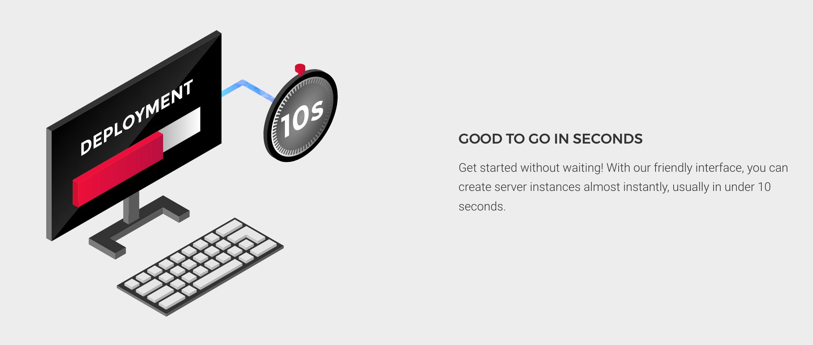

# End Of Field Challenge 👨🏼‍💻

The 'great' end of the field challenge has arrived! We have to re-create 2 (or 3) interfaces and think "pixel perfect".

Education provided by [BeCode](https://becode.org/) 🎓

# Check My Results Online 👀

- [Interface 1 - Simple (03)](https://wisecoding.github.io/end-of-field-challenge/index.html)
- [Interface 2 - Simple (20)](https://wisecoding.github.io/end-of-field-challenge/interface_2.html)
- [Interface 3 - Complex (07)](https://wisecoding.github.io/end-of-field-challenge/interface_3.html)

---

### Interface 1 - Simple (03) 📸

### Interface 2 - Simple (20) 📸

### Interface 3 - Complex (07) 📸

---

## <b>Built with</b> 🛠

- [Visual Studio Code](https://code.visualstudio.com/)
- [SASS](https://sass-lang.com/)
- [Markdown](https://www.markdownguide.org/)

---

## License 📎

MIT License
MIT © 2020 [WiseCoding](https://github.com/WiseCoding/) 🧙🏼‍♂️
