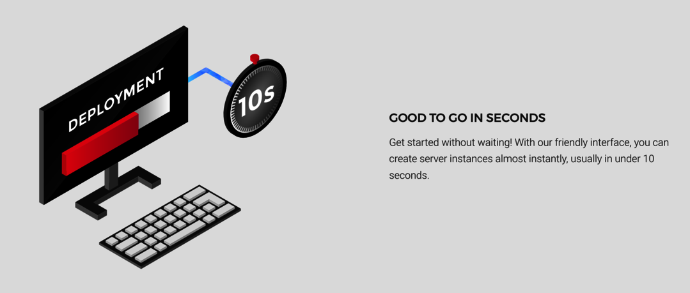

# End Of Field Challenge 👨🏼‍💻

The 'great' _end of the field challenge_ has arrived! We have to re-create 2 (or 3) interfaces and think _"pixel perfect"_.

_Education provided by [BeCode](https://becode.org/)_ 🎓

# Check My Results Online 👀

- [**Interface 1** - _Simple 03_](https://wisecoding.github.io/end-of-field-challenge/index.html)
- [**Interface 2** - _Simple 20_](https://wisecoding.github.io/end-of-field-challenge/interface_2.html)
- [**Interface 3** - _Complex 07_](https://wisecoding.github.io/end-of-field-challenge/interface_3.html)

# Interfaces

### **Interface 1** - _Simple 03_ 📸

### **Interface 2** - _Simple 20_ 📸

### **Interface 3** - _Complex 07_ 📸

# Built with 🛠

- [Visual Studio Code](https://code.visualstudio.com/)
- [SASS](https://sass-lang.com/)
- [Markdown](https://www.markdownguide.org/)
- [Before-after.js](https://github.com/jotform/before-after.js/)

# License 📎

MIT License
MIT © 2020 [_WiseCoding_](https://github.com/WiseCoding/) 🧙🏼‍♂️
